# digital-memorial 画面仕様書

> 自動生成: 2026-05-29 08:05:07

## 目次

- [ログイン画面](#login)
- [新規登録画面](#register)
- [ダッシュボード](#dashboard)
- [終活チェックリスト](#shukatsu)
- [相続計画一覧](#estate_list)
- [相続計画 - 家族構成](#estate_family)
- [相続計画 - 財産・負債](#estate_assets)
- [相続計画 - 計算結果](#estate_result)
- [遺言書シミュレーター](#estate_will)
- [エンディングノート](#ending_note)
- [デジタルカギ設定](#digital_key)
- [アカウント設定](#account)
- [墓誌作成画面](#memorial_new)
- [墓誌編集画面](#memorial_edit)
- [公開墓誌ページ](#memorial_public)
- [リマインダー設定](#reminders)

---

## ログイン画面 {#login}

**パス**: `/login`

既存ユーザーのログイン。メールアドレス・パスワード入力。

### 主要機能

- メールアドレス・パスワード入力フォーム
- ログインボタン（JWT発行→ダッシュボードへ遷移）
- 新規登録へのリンク
- 2FA TOTP対応（有効化済みユーザーのみ追加入力欄表示）

### 使用API

- `POST /auth/login`

### スクリーンショット

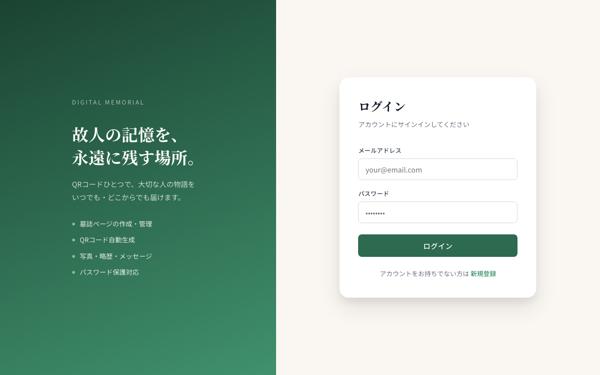
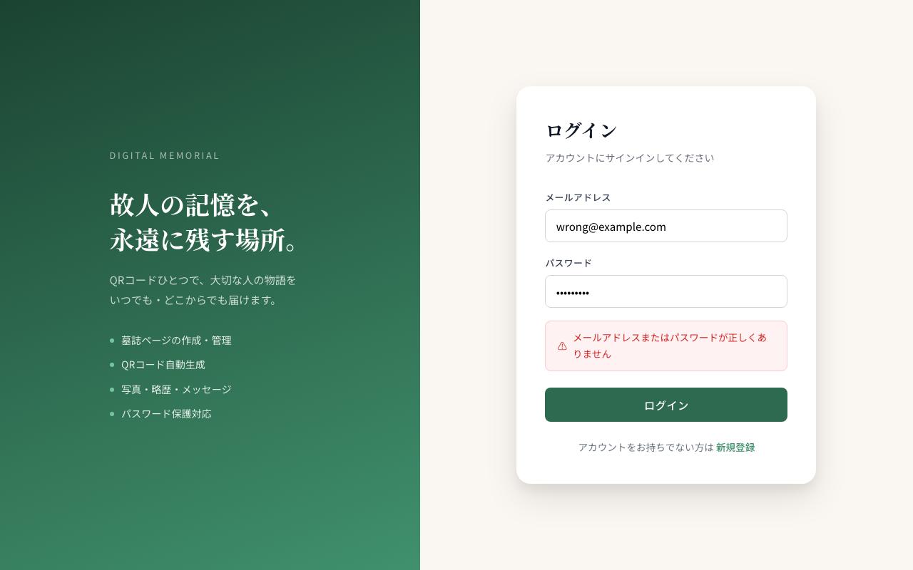

---

## 新規登録画面 {#register}

**パス**: `/register`

新規ユーザー登録。名前・メール・パスワード入力。

### 主要機能

- 名前・メールアドレス・パスワード入力フォーム
- 登録ボタン（成功後はダッシュボードへ遷移）
- 重複メール拒否バリデーション

### 使用API

- `POST /auth/register`

### スクリーンショット

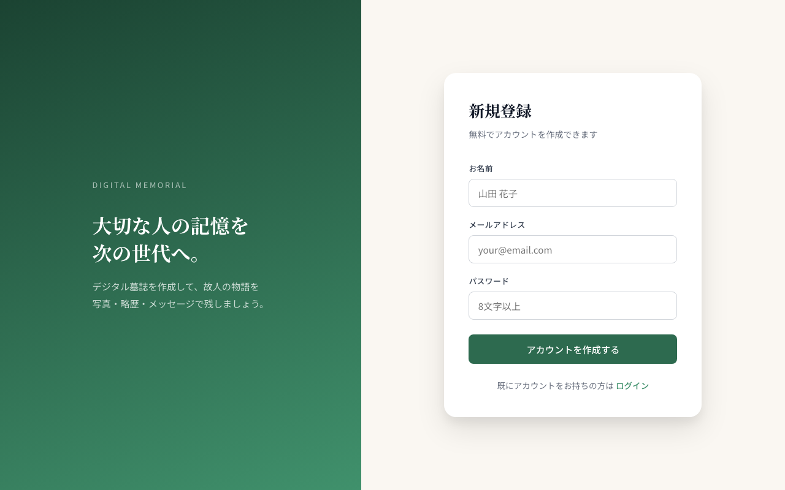
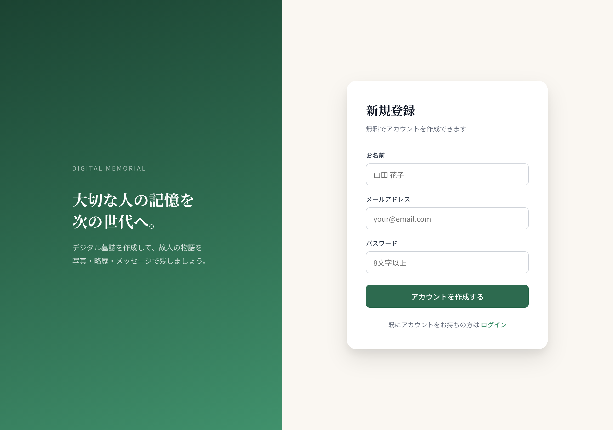

---

## ダッシュボード {#dashboard}

**パス**: `/dashboard`

ログイン後のトップ画面。進捗・未完了タスク・クイックリンク。

### 主要機能

- 墓誌一覧（新規作成ボタン・QRコードボタン・閲覧回数バッジ）
- クイックスタッツ: 墓誌数・相続計画数・終活完了率（プログレスバー）
- 完了率コーチングメッセージ（0-40%: 🌱, 40-80%: 💪, 80%+: 🎉）
- 次のおすすめアクションカード（最優先の未完了タスクへのCTA）
- 未完了タスクパネル（優先度フィルタートグル）
- かんたんモード: 簡易クイックリンク表示
- ヘルプツールチップ（?ボタン）
- オンボーディングモーダル（初回のみ）

### 使用API

- `GET /memorials`
- `GET /checklist`
- `GET /estate-plans`

### スクリーンショット

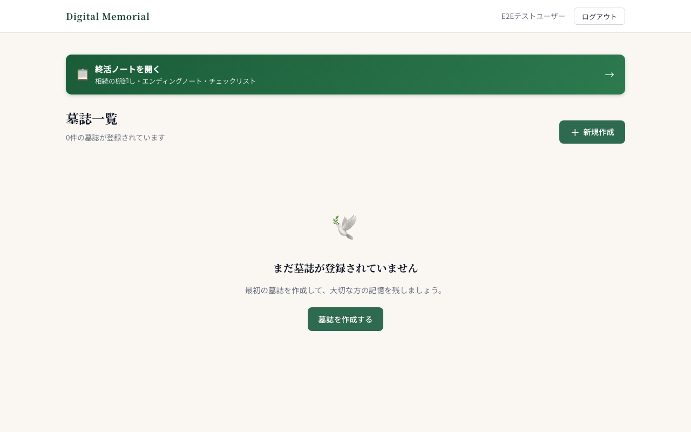

---

## 終活チェックリスト {#shukatsu}

**パス**: `/shukatsu`

終活タスクの一覧・進捗管理。カテゴリフィルター付き。

### 主要機能

- カテゴリフィルター（すべて/相続/遺言/医療/葬儀/デジタル/人間関係/ペット/思い出）
- カテゴリタブに完了数（N/M）と進捗バー表示
- チェックボックスで完了登録（即時保存）
- スコアカード（達成率%・SVGプログレスリング）
- 優先度バッジ（必須/推奨/任意）・星評価
- 各タスクへの直接リンク（入力するボタン）

### 使用API

- `GET /checklist`
- `POST /checklist/{task_key}/complete`
- `DELETE /checklist/{task_key}/complete`

### スクリーンショット

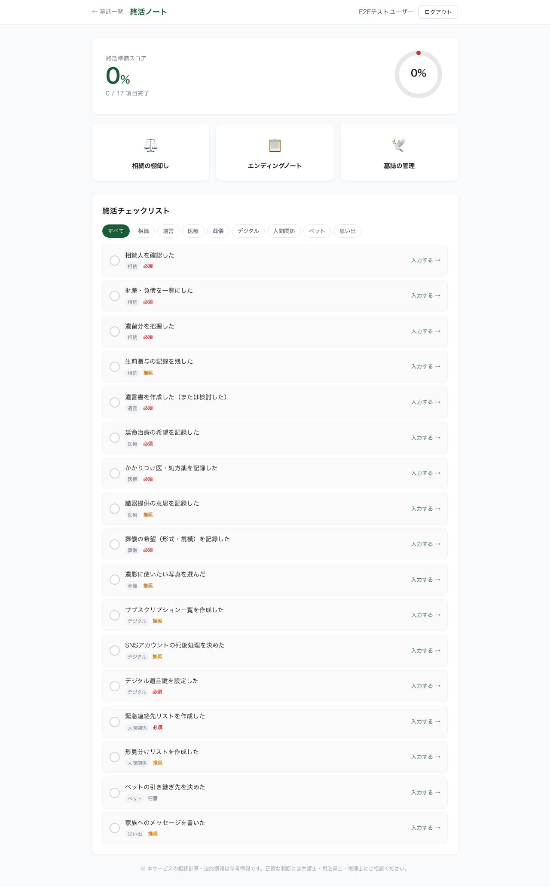

---

## 相続計画一覧 {#estate_list}

**パス**: `/estate`

相続計画の作成・一覧表示・削除・タイトル変更。

### 主要機能

- 新規作成モーダル（計画名入力）
- 計画カード（家族人数・財産総額・作成日）
- タイトル変更（✏️ボタン→インライン編集）
- 削除ボタン（確認ダイアログ付き）
- 各ステップへのリンク（家族構成/財産/計算結果/遺言書）

### 使用API

- `GET /estate-plans`
- `POST /estate-plans`
- `DELETE /estate-plans/{id}`
- `PATCH /estate-plans/{id}`

### スクリーンショット

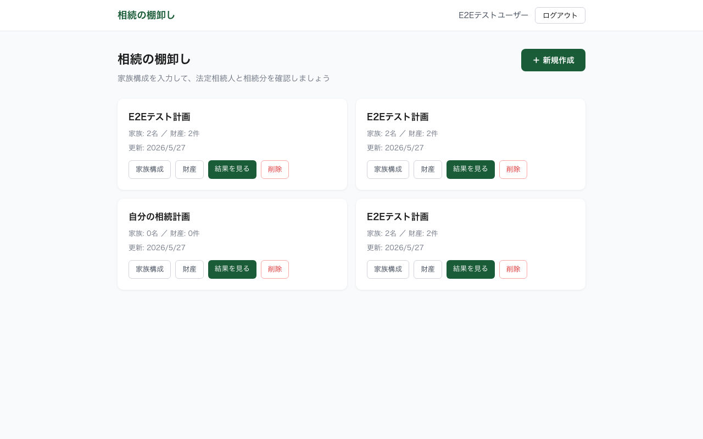
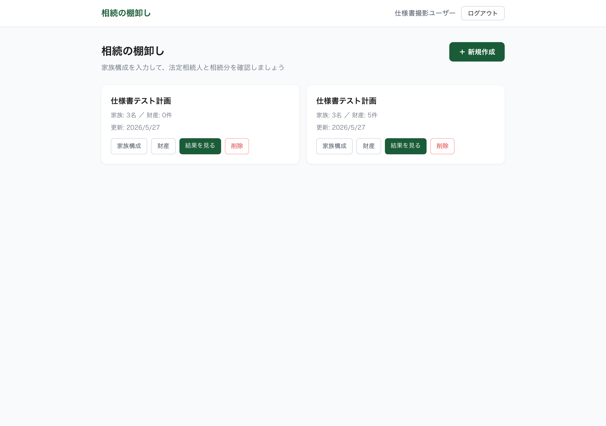

---

## 相続計画 - 家族構成 {#estate_family}

**パス**: `/estate/:id/family`

相続人となる家族メンバーを登録。関係性・存命状態・法的属性を設定。

### 主要機能

- 家族メンバー追加（配偶者/子/孫/親/兄弟姉妹）
- 存命フラグ（死亡時は代襲相続UIが展開）
- 養子・半血兄弟・相続放棄・欠格フラグ
- 代襲相続人（孫）の追加と代襲元選択
- 個人メッセージ欄（新機能: 各相続人への一言）
- 保存して次へボタン

### 使用API

- `GET /estate-plans/{id}/family`
- `POST /estate-plans/{id}/family`
- `DELETE /family-members/{id}`

---

## 相続計画 - 財産・負債 {#estate_assets}

**パス**: `/estate/:id/assets`

財産と負債を登録。種類別に詳細フィールドが表示される。

### 主要機能

- 財産追加ボタン（不動産/預貯金/有価証券/生命保険/退職金/年金/農地/その他）
- 負債追加ボタン
- 不動産・農地: 所在地・登記番号・固定資産税評価額・農地フラグ
- 生命保険・年金: 証券番号・保険会社・受取人
- みなし相続財産フラグ
- 保存して計算結果を見るボタン

### 使用API

- `GET /estate-plans/{id}/assets`
- `POST /estate-plans/{id}/assets`
- `DELETE /assets/{id}`

---

## 相続計画 - 計算結果 {#estate_result}

**パス**: `/estate/:id/result`

法定相続分・遺留分・相続税概算を表示。

### 主要機能

- 相続順位・相続人一覧
- 各相続人の相続分（分数・%・金額）
- 遺留分表示
- 基礎控除・相続税概算額（基礎控除超過時）
- 債務超過警告
- 資産配分円グラフ（SVG）
- 家族構成修正リンク
- 遺言書シミュレーターへのリンク

### 使用API

- `GET /estate-plans/{id}/inheritance`

### スクリーンショット

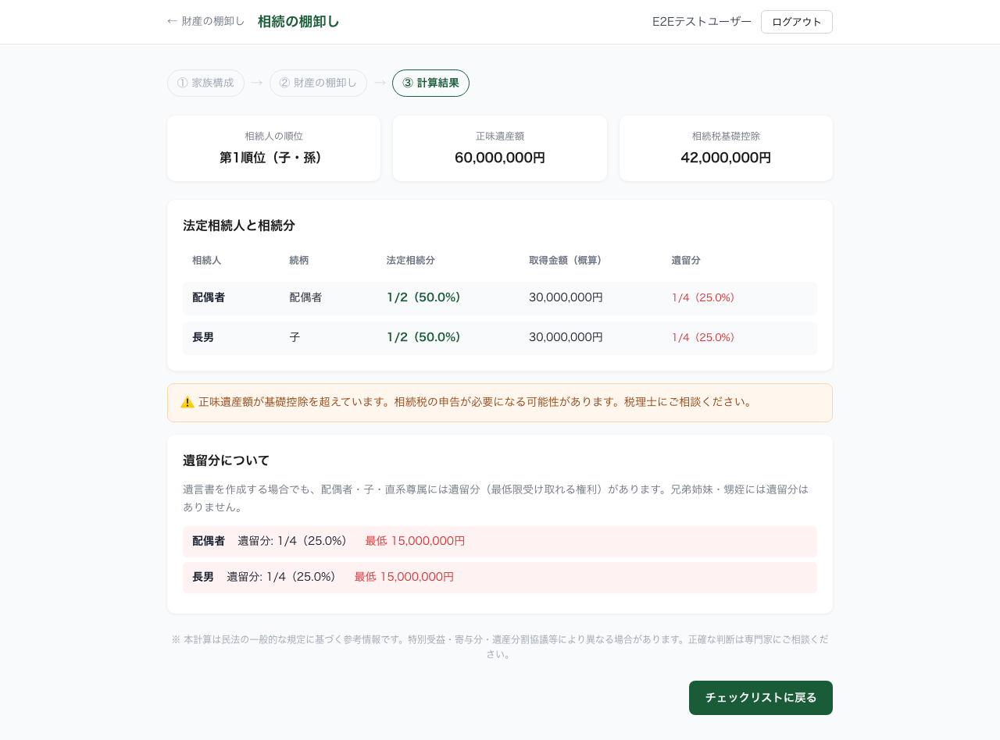

---

## 遺言書シミュレーター {#estate_will}

**パス**: `/estate/:id/will`

各相続人への希望配分を設定し、遺言書テンプレートを生成・印刷。

### 主要機能

- 相続人ごとの希望配分額入力（円）
- 合計・遺産総額の差額表示バリデーション
- 法定相続分に戻すボタン（ワンクリックでリセット）
- 遺留分侵害警告（不足時に赤色警告）
- 付言事項（遺言者メッセージ）入力
- 配分を保存ボタン
- 遺言書テンプレートプレビュー
- 遺言書印刷ボタン（@media print対応）

### 使用API

- `POST /estate-plans/{id}/will`

---

## エンディングノート {#ending_note}

**パス**: `/ending-note`

医療・葬儀・デジタル資産・ペットなど終末期の意思を記録。

### 主要機能

- タブ: 医療・介護 / 葬儀 / デジタル資産 / 形見分け / ペット / お気に入り / 家族へのメッセージ / 緊急連絡先（入力済みタブは●ドットインジケーター表示）
- 自動保存（1秒デバウンス）・保存タイムスタンプ表示
- 一括印刷ボタン（全タブ内容をA4印刷）
- 医療タブ: 延命治療/心肺蘇生/経管栄養/臓器提供意思・かかりつけ医・服薬
- 葬儀タブ: 形式選択・宗教・音楽・戒名希望・参列者数・埋葬方法
- デジタル資産タブ: サービス名・アカウント・死後処理方法 / サブスクリプション管理
- ペットタブ: 名前・種類・品種・マイクロチップ・ワクチン・獣医情報・引き継ぎ先
- お気に入りタブ: 好きな音楽・映画・食べ物（新機能）
- 緊急連絡先タブ: 名前・続柄・電話・メール・優先度

### 使用API

- `GET /ending-note`
- `PATCH /ending-note`
- `POST/DELETE /bequest-items /digital-assets /subscriptions /pets /emergency-contacts`

### スクリーンショット

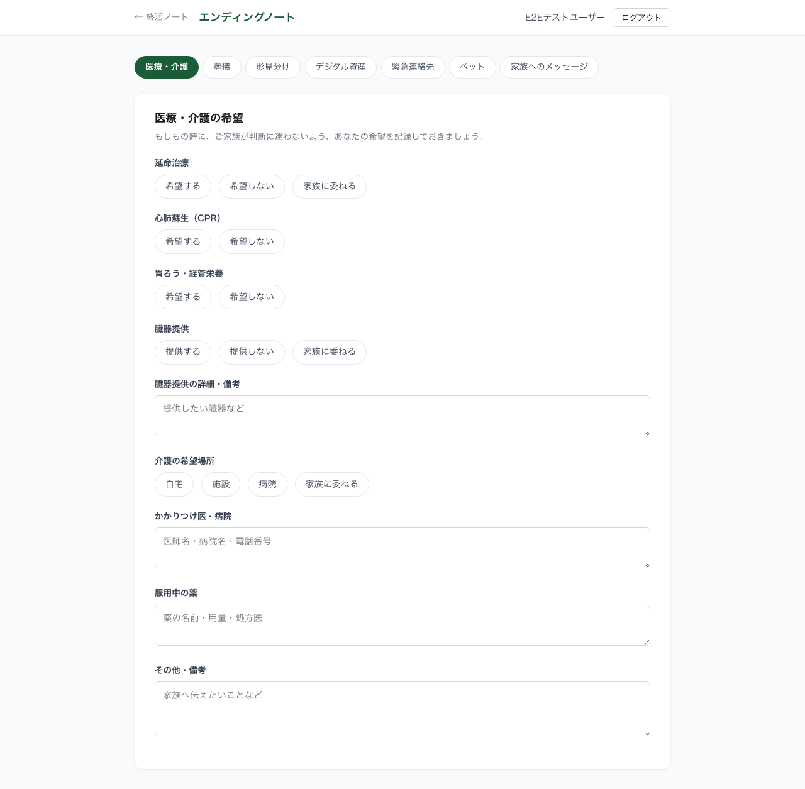
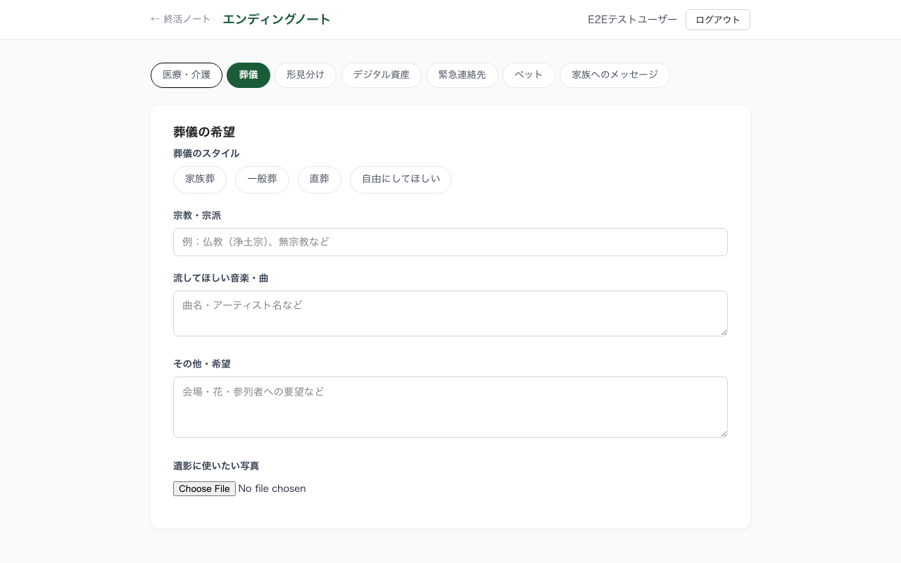

---

## デジタルカギ設定 {#digital_key}

**パス**: `/digital-key`

死後に信頼できる人へデジタル資産情報を開示するための設定。

### 主要機能

- 信頼できる人の登録（名前・メール）
- 解除条件選択（死亡証明書提出 / デッドマンスイッチ）
- デッドマンスイッチ: 有効/無効切替・チェックイン間隔（30/60/90/180/365日）
- チェックインボタン（最終確認日時の更新）
- メモ欄（自由記入）
- 保存ボタン

### 使用API

- `GET /digital-key`
- `PATCH /digital-key`
- `POST /digital-key/checkin`

### スクリーンショット

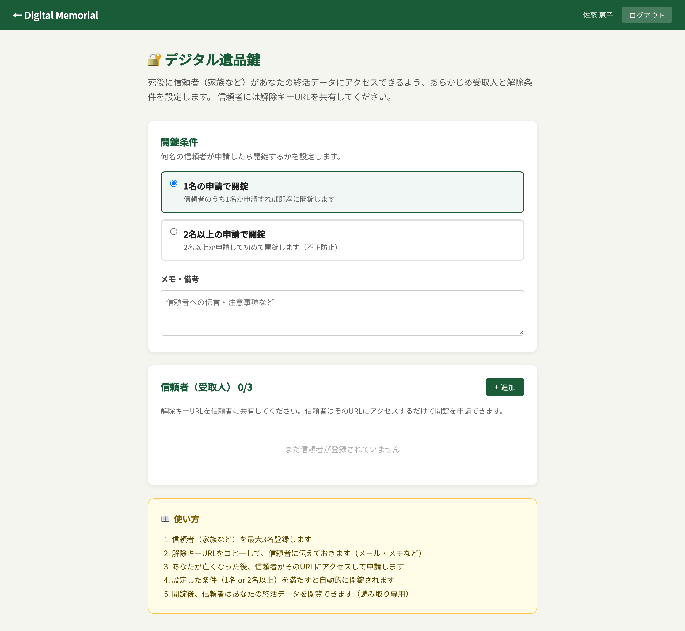
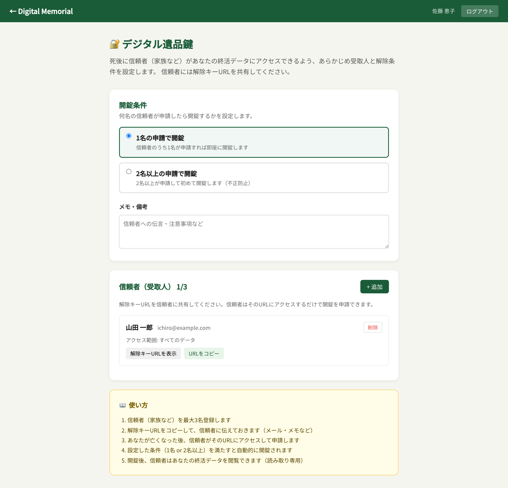
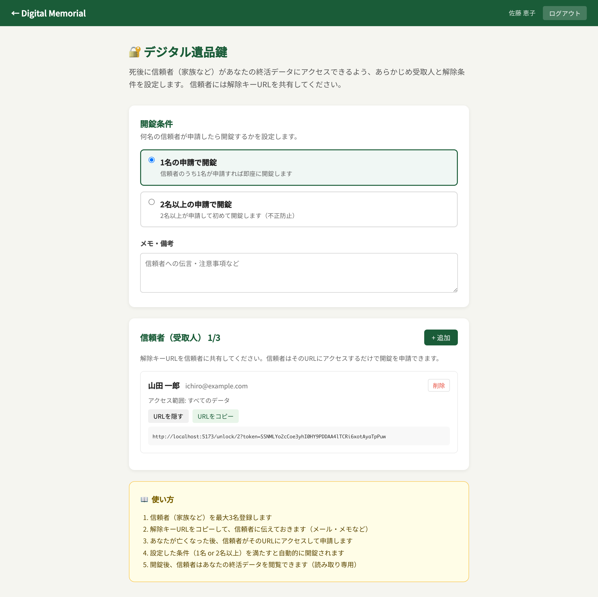

---

## アカウント設定 {#account}

**パス**: `/account`

ユーザープロファイル・セキュリティ・表示設定の管理。

### 主要機能

- パスワード変更フォーム
- フォントサイズ設定（小/標準/大/特大）- ボタン選択で即時プレビュー表示
- かんたんモード切替（シンプルUI）
- 最終ログイン日時表示
- 二要素認証（TOTP 2FA）: 設定QRコード表示・検証・無効化
- 活動ログ（最新30件表示）
- データエクスポート（JSON・CSV）
- アカウント削除（確認文字入力付き）

### 使用API

- `PATCH /auth/password`
- `PATCH /auth/preferences`
- `POST /auth/totp/setup`
- `POST /auth/totp/verify`
- `POST /auth/totp/disable`
- `GET /auth/activity-log`
- `GET /auth/export/csv`

---

## 墓誌作成画面 {#memorial_new}

**パス**: `/memorials/new`

故人の情報を入力して墓誌を新規作成。

### 主要機能

- 故人名・生年月日・没年月日入力
- 略歴・故人へのメッセージ（textarea）
- 公開/非公開切替
- パスワード保護（非公開時）
- 作成ボタン → 編集ページへ遷移

### 使用API

- `POST /memorials`

---

## 墓誌編集画面 {#memorial_edit}

**パス**: `/memorials/:id/edit`

既存墓誌の情報編集・写真アップロード。

### 主要機能

- 故人情報編集フォーム（名前・日付・略歴・メッセージ）
- 写真アップロード（ドラッグ&ドロップ対応）
- 写真のキャプション・アルバム名・撮影日・場所・エピソード編集
- 写真の公開/非公開切替
- 公開URLコピーボタン
- 保存ボタン

### 使用API

- `GET /memorials/{id}`
- `PUT /memorials/{id}`
- `POST /memorials/{id}/media`
- `DELETE /media/{id}`

### スクリーンショット

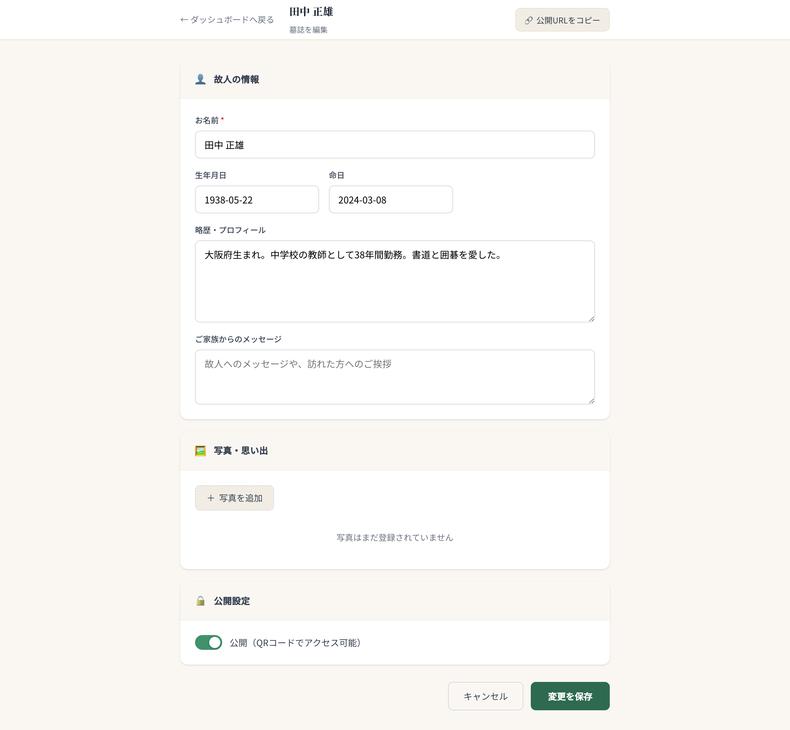
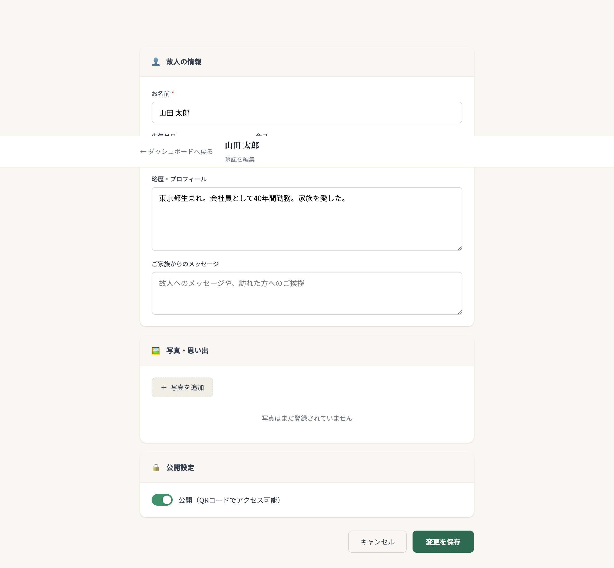

---

## 公開墓誌ページ {#memorial_public}

**パス**: `/m/:slug`

QRコードでアクセス可能な故人の追悼ページ（ログイン不要）。

### 主要機能

- 故人名・生没年表示
- 略歴・メッセージ
- 写真ギャラリー（公開設定の写真のみ）
- パスワード保護ページ（非公開設定時）

### 使用API

- `GET /m/{slug}`

---

## リマインダー設定 {#reminders}

**パス**: `/settings/reminders`

定期的なリマインダー通知の設定。

### 主要機能

- 通知有効/無効トグル
- リマインダー頻度選択（月次/四半期/年次）
- 通知タイプ選択（メール/ブラウザ）
- 保存ボタン

### 使用API

- `GET /reminder-settings`
- `PATCH /reminder-settings`

---
