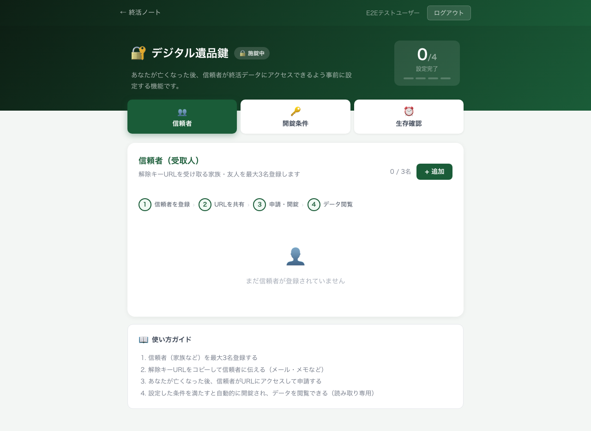
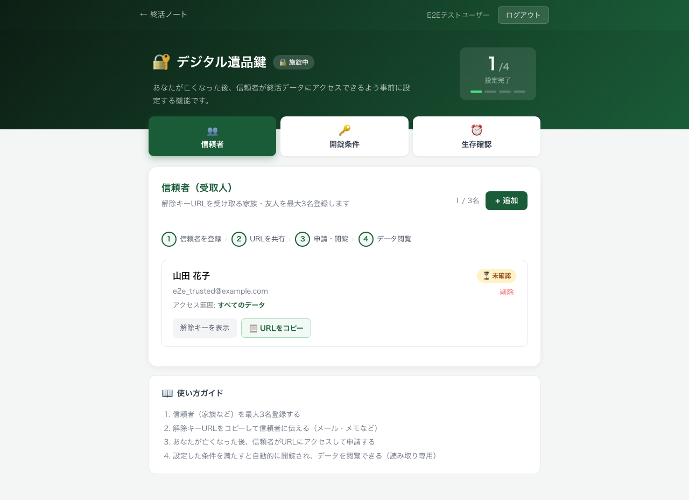
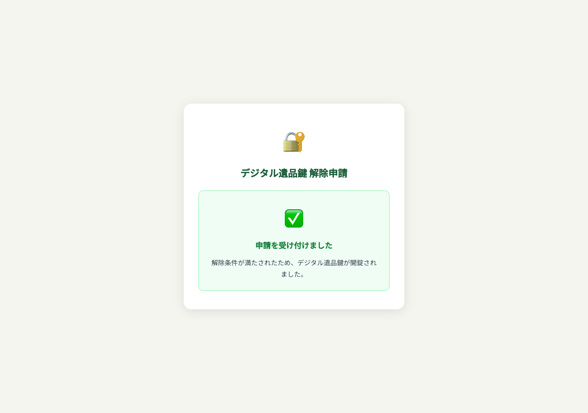
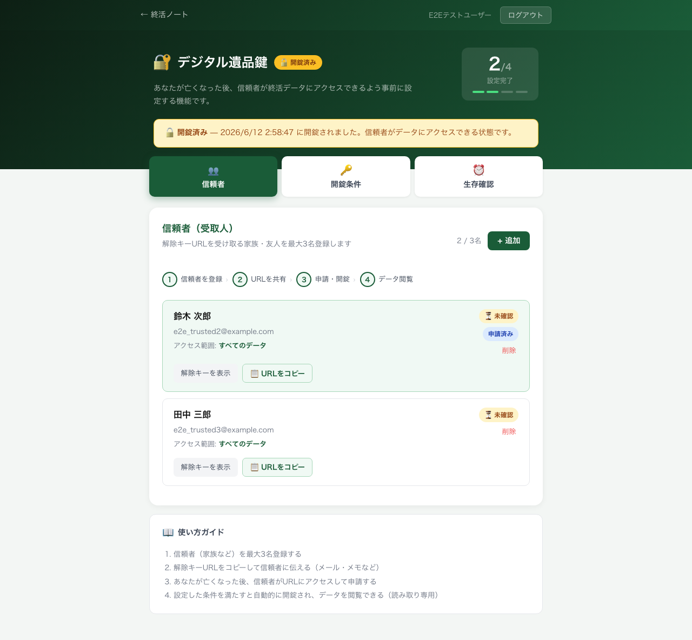

# デジタル遺品鍵 E2E機能試験レポート

**実施日時**: 2026-06-12 11:59:06  
**対象URL**: https://kotsaito-digital-memorial.hf.space/digital-key  
**合計**: 34 件 / ✅ PASS: 34 件 / ❌ FAIL: 0 件  
**スクリーンショット**: `e2e/screenshots/digital_key/`

---

## 機能一覧・テスト結果エビデンス

| ID | カテゴリ | 機能 | 結果 | 詳細 | スクリーンショット |
|---|---|---|---|---|---|
| F01 | 基盤 | HF Space 到達 / ページタイトル確認 | ✅ | title='Digital Memorial - デジタル墓誌' | [F01_top.png](screenshots/digital_key/F01_top.png) |
| F02 | 認証 | テストユーザーでログイン | ✅ | ダッシュボードに遷移 | [F02_dashboard.png](screenshots/digital_key/F02_dashboard.png) |
| F03 | 表示 | デジタル鍵ページ表示 (ヒーロー・タイトル) | ✅ | h1='デジタル遺品鍵' 確認 | [F03_digital_key_initial.png](screenshots/digital_key/F03_digital_key_initial.png) |
| F04 | 表示 | 施錠中バッジ表示 | ✅ | 🔒 施錠中バッジ確認 | [F04_locked_badge.png](screenshots/digital_key/F04_locked_badge.png) |
| F05 | 表示 | セットアップスコア (0/4) 表示 | ✅ | スコア表示: '0/4' | [F05_setup_score.png](screenshots/digital_key/F05_setup_score.png) |
| F06 | 信頼者 | 信頼者タブ・空状態表示 | ✅ | 空状態メッセージ表示確認 | [F06_trusted_tab_empty.png](screenshots/digital_key/F06_trusted_tab_empty.png) |
| F07 | 信頼者 | 信頼者追加フォームを開く | ✅ | フォーム表示確認 | [F07_add_form_open.png](screenshots/digital_key/F07_add_form_open.png) |
| F08 | 信頼者 | 信頼者登録（名前・メール・アクセス範囲） | ✅ | '山田 花子' 表示確認 | [F08_after_register.png](screenshots/digital_key/F08_after_register.png) |
| F09 | 信頼者 | 信頼者カード詳細（メール・アクセス範囲・メール確認バッジ） | ✅ | メール・アクセス範囲・⏳未確認バッジ確認 | [F09_trusted_card.png](screenshots/digital_key/F09_trusted_card.png) |
| F10 | 信頼者 | 信頼者カウンタ (1/3名) | ✅ | 1 / 3名 表示確認 | [F10_counter.png](screenshots/digital_key/F10_counter.png) |
| F11 | 信頼者 | 解除キーURL表示（トグル） | ✅ | /unlock/ と token= 含む URL 確認 | [F11_unlock_url_shown.png](screenshots/digital_key/F11_unlock_url_shown.png) |
| F12 | 信頼者 | APIから解除キートークン取得 | ✅ | person_id=1, access_token 取得確認 | - |
| F13 | 信頼者 | 解除キーURLコピーボタン | ✅ | '✓ コピー済み' 表示確認 | [F13_copy_done.png](screenshots/digital_key/F13_copy_done.png) |
| F14 | 開錠条件 | 開錠条件タブ切り替え・表示 | ✅ | 開錠条件タブ内容確認 | [F14_condition_tab.png](screenshots/digital_key/F14_condition_tab.png) |
| F15 | 開錠条件 | 開錠条件「1名」選択・保存 | ✅ | API: unlock_condition='one_request' | [F15_condition_one.png](screenshots/digital_key/F15_condition_one.png) |
| F16 | 開錠条件 | 開錠条件「2名以上」選択・保存 | ✅ | API: unlock_condition='two_requests' | [F16_condition_two.png](screenshots/digital_key/F16_condition_two.png) |
| F17 | 開錠条件 | メモ（備考）保存 | ✅ | API: notes='E2Eテスト用メモ: パスワードは金庫の中' | [F17_notes_saved.png](screenshots/digital_key/F17_notes_saved.png) |
| F18 | 生存確認 | 生存確認タブ切り替え・表示 | ✅ | デッドマンスイッチ表示確認 | [F18_deadman_tab.png](screenshots/digital_key/F18_deadman_tab.png) |
| F19 | 生存確認 | デッドマンスイッチ OFF 状態表示 | ✅ | ⏸️アイコンと説明文表示確認 | [F19_deadman_off.png](screenshots/digital_key/F19_deadman_off.png) |
| F20 | 生存確認 | デッドマンスイッチ ON | ✅ | API: deadman_enabled=True | [F20_deadman_on.png](screenshots/digital_key/F20_deadman_on.png) |
| F21 | 生存確認 | 通知日数 60日 選択・保存 | ✅ | API: deadman_interval_days=60 | [F21_interval_60.png](screenshots/digital_key/F21_interval_60.png) |
| F22 | 生存確認 | 生存確認チェックイン | ✅ | API: last_checkin_at=2026-06-12T02:58:23 | [F22_checkin_done.png](screenshots/digital_key/F22_checkin_done.png) |
| F23 | 生存確認 | 残り日数カウンタ表示 | ✅ | '残り 60 日' 表示確認 | [F23_days_remaining.png](screenshots/digital_key/F23_days_remaining.png) |
| F24 | 生存確認 | デッドマンスイッチ OFF に戻す | ✅ | API: deadman_enabled=False | [F24_deadman_off_again.png](screenshots/digital_key/F24_deadman_off_again.png) |
| F25 | 信頼者上限 | 信頼者3名登録・上限で追加ボタン非表示 | ✅ | 3 / 3名 表示 / + 追加ボタン: 非表示 | [F25_three_persons_tab.png](screenshots/digital_key/F25_three_persons_tab.png) |
| F26 | 信頼者上限 | 4名目追加 API が 400 を返す | ✅ | HTTP 400 / "信頼者は最大3名まで登録できます" | - |
| F27 | 信頼者 | 信頼者削除 | ✅ | API: 削除後 2 名 | [F27_after_delete.png](screenshots/digital_key/F27_after_delete.png) |
| F28 | 開錠申請 | 解除申請ページ表示（ログイン不要） | ✅ | タイトル・申請ボタン確認 | [F28_unlock_page.png](screenshots/digital_key/F28_unlock_page.png) |
| F29 | 開錠申請 | 解除申請実行・開錠成立（1名条件） | ✅ | API: is_unlocked=True / 開錠完了メッセージ表示 | [F29_unlock_success.png](screenshots/digital_key/F29_unlock_success.png) |
| F30 | 開錠申請 | 開錠済みバナー・バッジ表示 | ✅ | 🔓 開錠済み 2箇所表示（バッジ+バナー） | [F30_unlocked_banner.png](screenshots/digital_key/F30_unlocked_banner.png) |
| F31 | セキュリティ | 無効トークンで申請 API が 403 を返す | ✅ | HTTP 403 確認 | - |
| F32 | セキュリティ | メール確認エンドポイント | ✅ | HTTP 200 / "✅ メールアドレスが確認されました" | - |
| F33 | ナビ | ← 終活ノートへのナビゲーション | ✅ | /shukatsu に遷移確認 | [F33_back_nav.png](screenshots/digital_key/F33_back_nav.png) |
| F34 | 認証 | ログアウトボタン | ✅ | /login に遷移確認 | [F34_logout.png](screenshots/digital_key/F34_logout.png) |

---

## カテゴリ別サマリー

| カテゴリ | 件数 | PASS | FAIL |
|---|---|---|---|
| 基盤・到達確認 | 1 | 1 | 0 |
| 認証（ログイン・ログアウト） | 2 | 2 | 0 |
| ページ表示・UI | 3 | 3 | 0 |
| 信頼者 CRUD | 9 | 9 | 0 |
| 信頼者上限制御 | 2 | 2 | 0 |
| 開錠条件設定 | 3 | 3 | 0 |
| 生存確認スイッチ | 6 | 6 | 0 |
| 開錠申請・開錠フロー | 3 | 3 | 0 |
| セキュリティ | 2 | 2 | 0 |
| ナビゲーション | 1 | 1 | 0 |
| **合計** | **34** | **34** | **0** |

---

## 主要スクリーンショット

### 初期表示（施錠中・0/4）

### 信頼者登録後

### 解除申請成功・開錠完了

### 開錠済みバナー

---

## 失敗項目

なし（全34項目 PASS）

---

## テスト環境

- 対象: Hugging Face Spaces `kotsaito/digital-memorial`
- ブラウザ: Playwright Chromium (headless)
- テストユーザー: `e2e_digital_key@example.com`
- 実行コマンド: `python3 e2e/test_digital_key_e2e.py`
